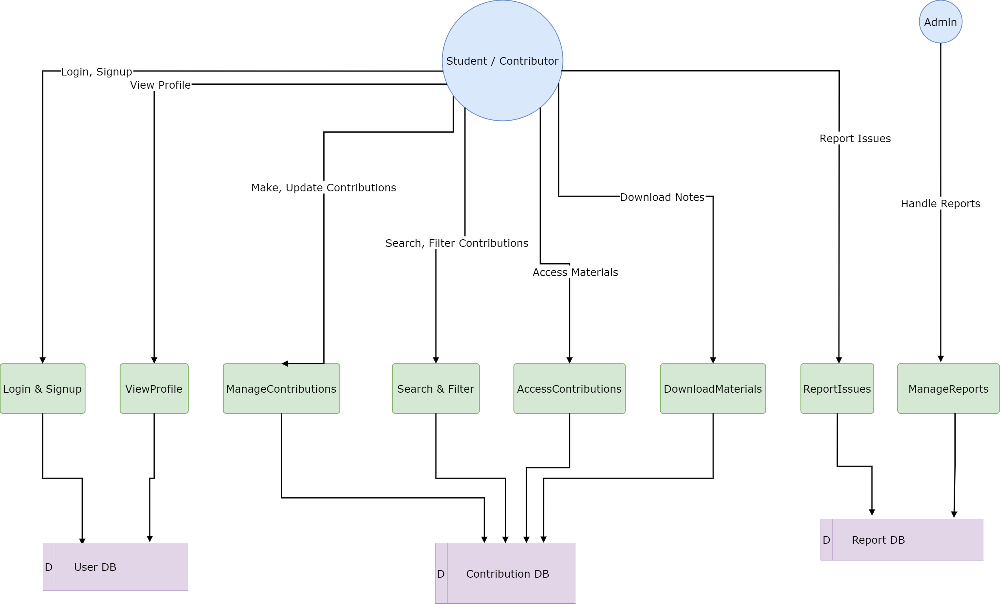
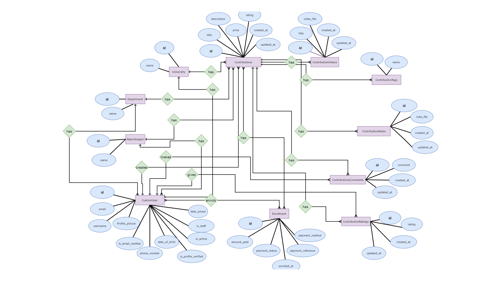
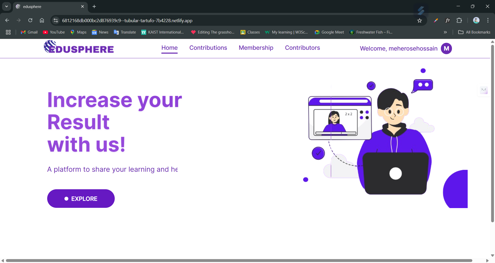
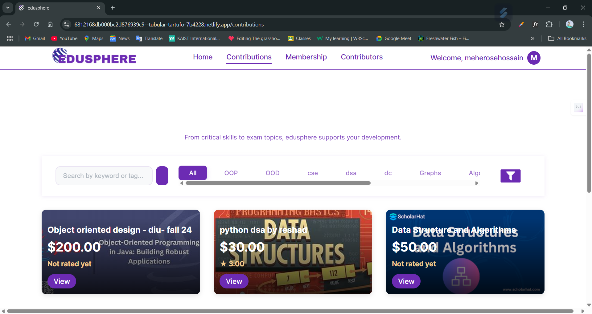
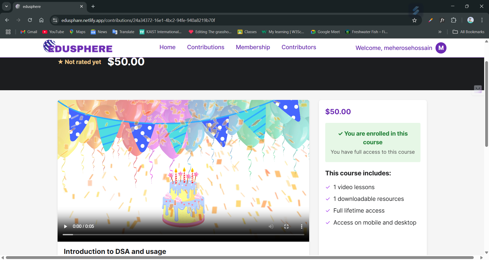
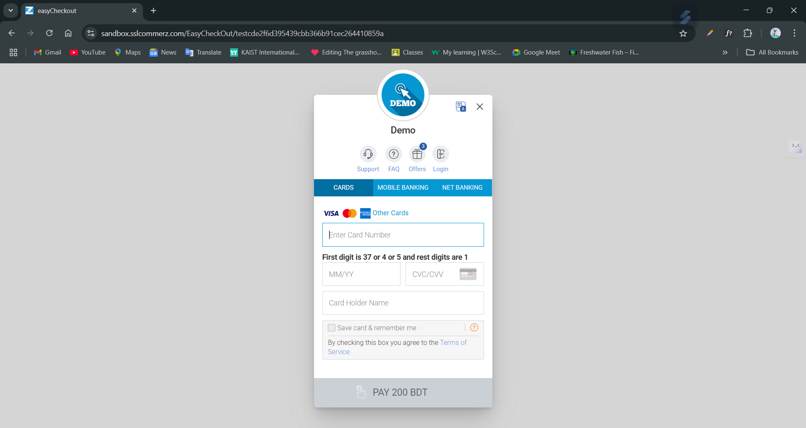
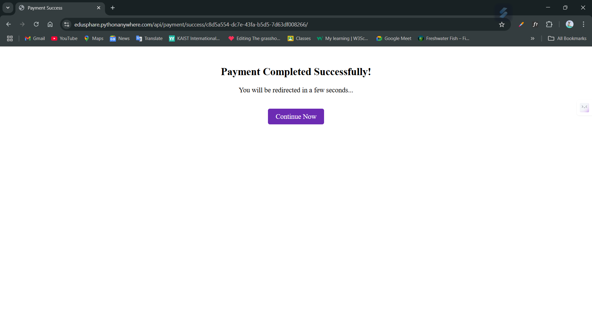
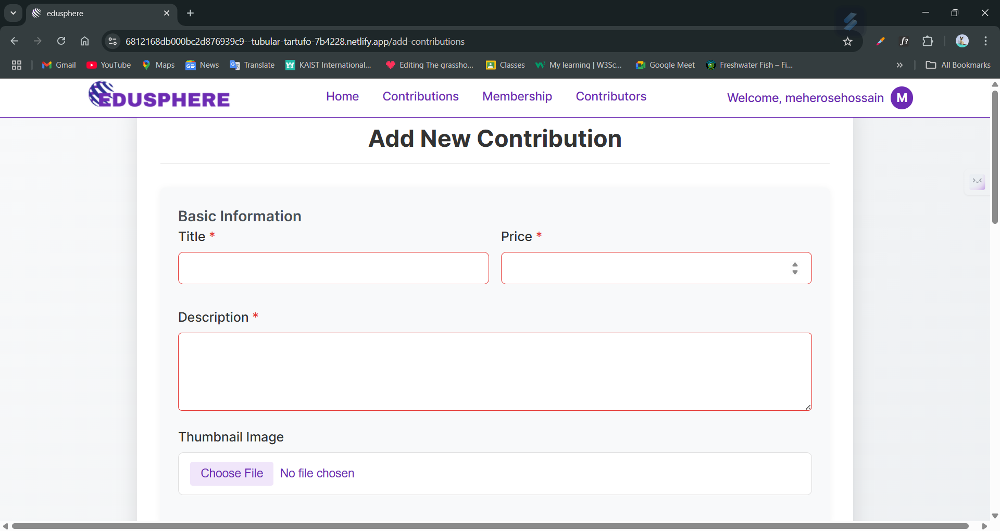

<p align="center">
  
</p>

<p align="center">
  🚀 <a href="https://edusphare.netlify.app/" target="_blank"><strong>Live Frontend Demo</strong></a> | 🔧 <a href="https://edusphare.pythonanywhere.com" target="_blank"><strong>Live Backend API</strong></a>
</p>


---

### 📚 Resources
- [👥 Team Members](#-team-members)
- [📘 Project Description](#-project-description)
- [✨ Key Highlights](#-key-highlights)
- [🎯 Stakeholders](#-stakeholders)
- [📋 SRS - Functional Requirements](#-srs---functional-requirements)
- [📈 Diagrams](#-diagrams)
- [🛠 Tech Stack](#-tech-stack)
- [🧑‍💻 Getting Started](#-getting-started)
- [📏 Development Guidelines](#-development-guidelines)


---

 ## 👥 Team Members

  <p align="left">
    <a href="https://github.com/mhtasnia" target="_blank" style="text-decoration: none;">
      
    </a>
    <a href="https://github.com/reshadMajumder" target="_blank" style="text-decoration: none;">
      
    </a>
    <a href="https://github.com/Rokibul-Islam-Robi" target="_blank" style="text-decoration: none;">
      
    </a>
  </p>


---

**👨‍🏫 Mentor:** Minhazul Hasan

---

## 📘 Project Description
EduSphere is a dynamic online platform designed to enhance university learning through:

- Personalized learning pathways  
- Academic collaboration  
- Peer teaching opportunities  
- Resource sharing

It empowers students to seamlessly transition between the roles of learner and mentor, improving outcomes and fostering community.

---

## ✨ Key Highlights
- 📚 **Academic Resource Hub** – Share study materials, notes, etc.  
- 🤝 **Peer-to-Peer Collaboration** – Group projects, discussions  
- 🧠 **Teach What You Know** – Students mentor others  
- 🏫 **Community Building** – Strong academic network

---

## 🎯 Stakeholders
| Role   | Description |
|--------|-------------|
| 👩‍🎓 **Student** | Primary users, access & share learning resources |
| 👨‍💼 **Admin**   | Oversees system, maintains integrity & security |

---

## 📋 Software Requirements Specification (SRS) - Functional Requirements

| ID     | Feature                      | Description                                              | Stakeholders     |
|--------|------------------------------|----------------------------------------------------------|------------------|
| FR01   | Login                        | User login with credentials                              | Student, Admin   |
| FR02   | Signup                       | Register with name, email, university, etc.              | Student          |
| FR07   | Make Contributions           | Share notes, videos, etc.                                | Student          |
| FR10   | Search Contributions         | Search by name or contribution type                      | Student, Admin   |
| FR12   | Filter by University/Dept    | Narrow resources based on institution                    | Student, Admin   |
| FR14   | Help & Support               | Assistance on platform usage                             | Student          |
| FR15   | Report a Contribution        | Flag inappropriate or inaccurate materials               | Student, Admin   |
| FR16   | Download Materials           | Download PDFs of shared notes                            | Student          |
| FR17   | Take Notes                   | Make timestamped notes on video lectures                 | Student          |
| FR18   | Make Payment                 | Pay to access peer-created premium content               | Student          |
| FR19   | Request Refund               | Submit refund request with reason                        | Student          |


---

## 📈 Diagrams

### 📊 Data Flow Diagram



### 📊 Entity Relationship Diagram


---
---
## 🖼️ Application Screenshots

### 🏠 Home Page



### 📊 Contribution Page



### 📚 Course Detail View




### 💳 Payment Page

Shows the interface where users complete transactions to access premium study materials.




---

### 🔒 Before Buying Contribution Page

Displays a locked view of a contribution before purchase, encouraging users to buy access.


---

### ➕ Add Contribution Page

Enables students to upload notes, videos, or other academic resources to the platform.

![Add Contribution Page]
<p align="center">
  
  
</p>
---
## 🛠 Tech Stack

**Frontend:**  
- ⚛️ ReactJS  

**Backend:**  
- 🐍 Django  
- 🗃️ PostgreSQL  
- 🔄 Django ORM  

**Other Tools:**  
- 📝 Markdown (logs, docs)  
- 🔀 Git & GitHub  
- 🚀 Deployment (TBD)

---

## 🧑‍💻 Getting Started

```bash
# Clone the repository
git clone https://github.com/Learnathon-By-Geeky-Solutions/pipinstallc.git

# Install dependencies
cd frontend && npm install
cd backend && pip install -r requirements.txt

# Start development
npm start   # for frontend
python manage.py runserver  # for backend
