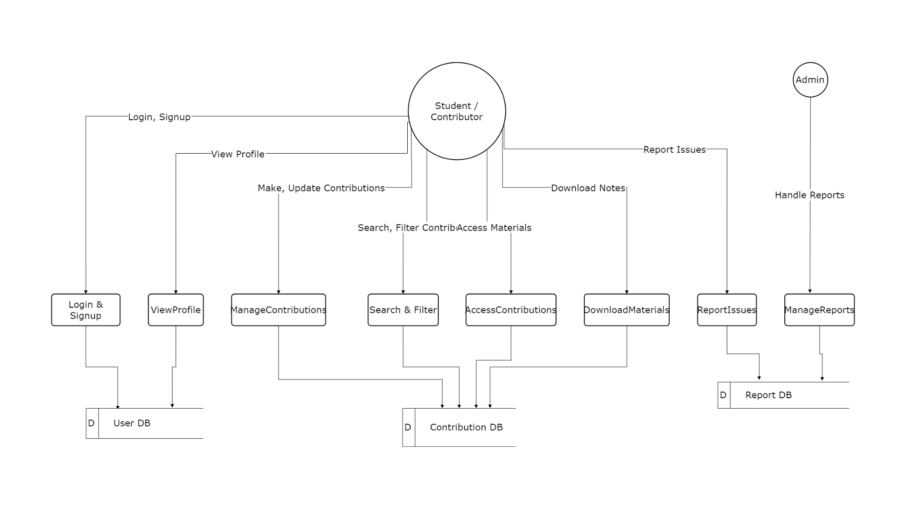

# pipinstallc

## Resources
- [Team Members](#team-members)
- [Project Description](#project-description)
- [Key Highlights](#key-highlights)
- [Stakeholders](#stakeholders)
- [SRS](#software-requirements-specification-srs---functional-requirements)
- [Diagrams](#diagrams)
  - [Data Flow Diagram](#data-flow-diagram)
- Tech Stack(#tech-stack)
- [Development Setup](docs/setup.md)
- [Contributing Guidelines](CONTRIBUTING.md)

## Team Members
- mhtasnia (Team Leader)
- reshadMajumder
- Rokibul-Islam-Robi

## Mentor
- MinhazulHasan

## Project Description
EduSphere is envisioned as a dynamic online platform designed to enhance the university learning experience through personalized learning pathways, academic collaboration, and resource sharing. Addressing the challenges of traditional learning environments, EduSphere will empower university students to learn at their own pace, access relevant academic resources, and connect with peers for collaborative learning. 

This platform will foster an academic community where students can seamlessly transition between the roles of learner and teacher. By providing tools for personalized teaching and mentorship, EduSphere aims to improve student outcomes, build a strong sense of community, and create a more supportive and effective learning ecosystem for university students.

## Key Highlights
- **Academic Resource Hub:** Centralized repository for sharing study materials, notes, and other academic resources. 

- **Peer-to-Peer Collaboration:** Features to facilitate group projects, study groups, and knowledge exchange. 

- **Personalized Teaching Opportunities:** Students can share their expertise and provide guidance to others. 

- **Community Building:** Fostering a strong and supportive academic network among university students.

## Stakeholders
- **Student:** University students are the primary users and the core beneficiary group of the EduSphere platform. They will utilize EduSphere to enhance their learning experience, access academic resources, collaborate with peers, and potentially share their own knowledge. Students will play the role of both learner and teacher within the system

- **Admin:** Administrators are responsible for the overall management, operation, and maintenance of the EduSphere platform. This group ensures the platform functions smoothly, remains secure, and meets the needs of its users. Administrators oversee the technical and operational aspects of EduSphere.

## Software Requirements Specification (SRS) - Functional Requirements

| FR 01        | login                                  |
|--------------|----------------------------------------|
| Description  | User can login using their credentials |
| Stakeholders | Admin, student                        |

| FR 02        | Signup                                 |
|--------------|----------------------------------------|
| Description  | Students can sign up using their info like name, email, phone, university  |
| Stakeholders | Admin, student                        |

| FR 03        |Logout                                  |
|--------------|----------------------------------------|
| Description  | User can logout when they want         |
| Stakeholders | Admin, student                        |

| FR 04        |View profile                              |
|--------------|----------------------------------------|
| Description  | User can view profile information     |
| Stakeholders | Student                        |

| FR 05        |Update profile                             |
|--------------|----------------------------------------|
| Description  | User can update profile information     |
| Stakeholders | Student                        |

| FR 06        |View contributions                           |
|--------------|----------------------------------------|
| Description  | User can view all the contributions of a particular student in view profile section     |
| Stakeholders | Admin, student                        |

| FR 07        |Make contributions                          |
|--------------|----------------------------------------|
| Description  | All users can provide contributions like course video, notes etc.    |
| Stakeholders | Student                        |

| FR 08        |Update contributions                         |
|--------------|----------------------------------------|
| Description  | User can update their provided contribution data anytime   |
| Stakeholders | Student                        |

| FR 09        |Access contributions                        |
|--------------|----------------------------------------|
| Description  |Users can search and get any contribution data that they are enrolled in    |
| Stakeholders | Student                         |

| FR 10        |Search by contributor or contributions                       |
|--------------|----------------------------------------|
| Description  |Users can search contributions by contributor name or contribution name    |
| Stakeholders |Admin, Student                | 

| FR 11        |Filter by contributor or contributions                       |
|--------------|----------------------------------------|
| Description  |User can filter contributions by contributor name or contribution name    |
| Stakeholders |Admin, Student                | 

| FR 12        |Filter by university or departments                        |
|--------------|----------------------------------------|
| Description  |User can filter contributions by university name or department name    |
| Stakeholders |Admin, Student                | 

| FR 13        |Filter by course                        |
|--------------|----------------------------------------|
| Description  |User can filter contributions by the course name    |
| Stakeholders |Admin, Student                | 

| FR 14        |Help and support                        |
|--------------|----------------------------------------|
| Description  |Users can get any type of support from here. This can be how to use the website, how to enroll, how to earn from here etc.  |
| Stakeholders |Student                | 

| FR 15        |Report a contribution                        |
|--------------|----------------------------------------|
| Description  |User can report a contribution if they see any issues  |
| Stakeholders |Admin, student                | 

| FR 16        |Download contribution materials                        |
|--------------|----------------------------------------|
| Description  |Users can download contribution notes as pdf  |
| Stakeholders |Student                    | 

| FR 17        |Take Notes                        |
|--------------|----------------------------------------|
| Description  |Learners can take note from a specific section of the video lecture  |
| Stakeholders |Student                    | 

| FR 18        |Make Payment                        |
|--------------|----------------------------------------|
| Description  |Users will pay the course fee to access the study materials provided by other students  |
| Stakeholders |Student                    | 

| FR 19        |Request Refund                        |
|--------------|----------------------------------------|
| Description  |Userss can request for refunds showing a reasonable cause  |
| Stakeholders |Student                    | 

## Diagrams

### Data Flow Diagram

## Tech Stack

- **Frontend:**

    - **Framework:** ReactJS

- **Backend:**

  - **Framework:** Django
  - **ORM:** Django ORM
  - **Database:** PostgreSQL

- **Other:**
  - **Logging:** GitHub Markdown files
  - **Version Control:** Git (GitHub)
  - **Deployment:** 

## Getting Started
1. Clone the repository
2. Install dependencies
3. Start development

## Development Guidelines
1. Create feature branches
2. Make small, focused commits
3. Write descriptive commit messages
4. Create pull requests for review

